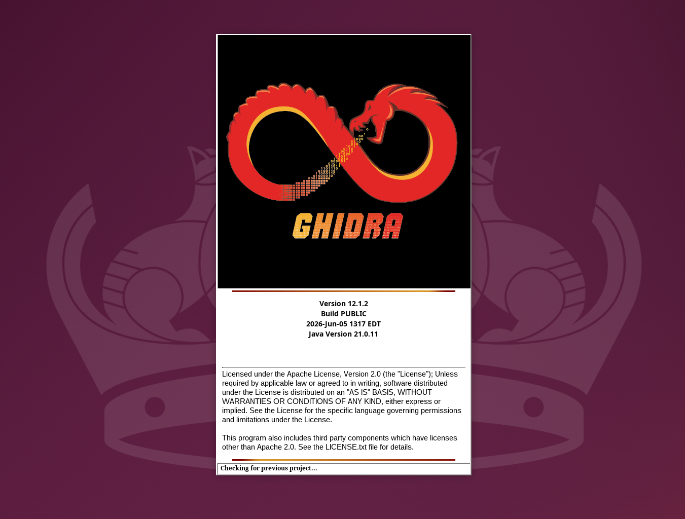
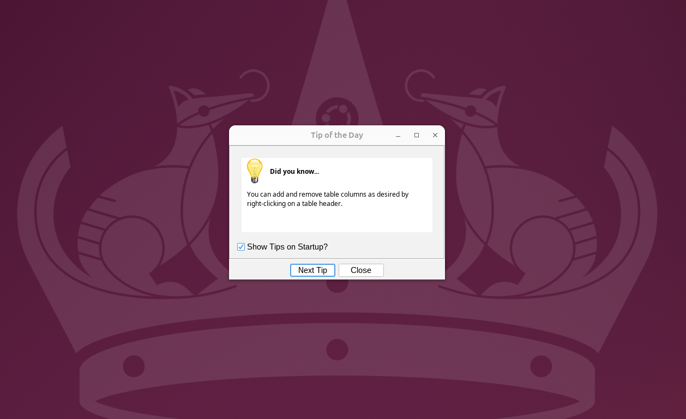
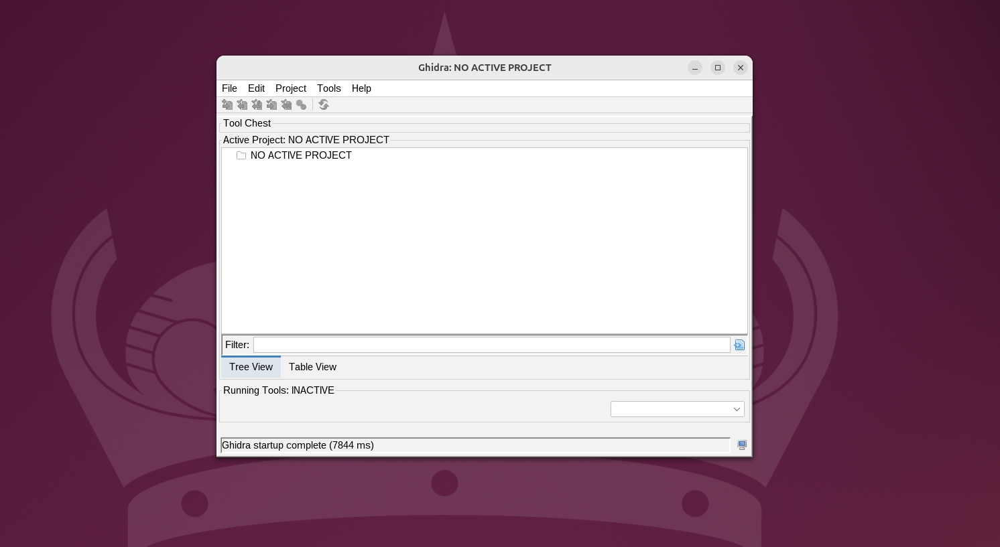
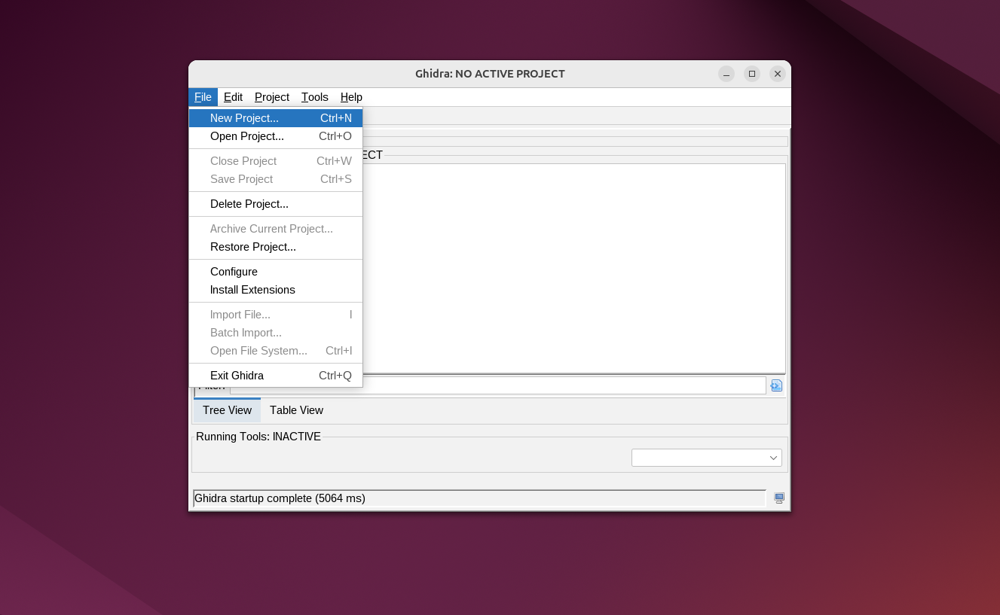
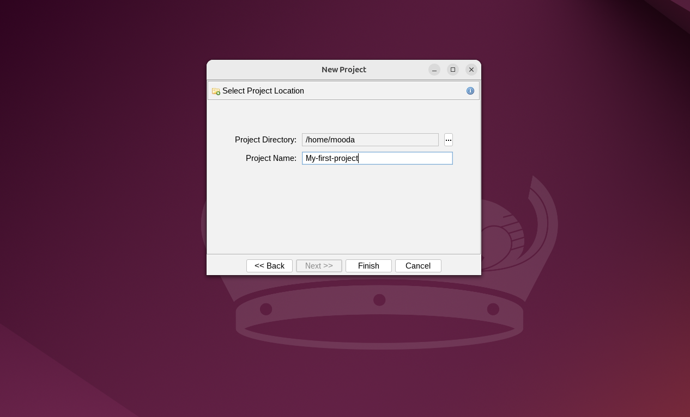
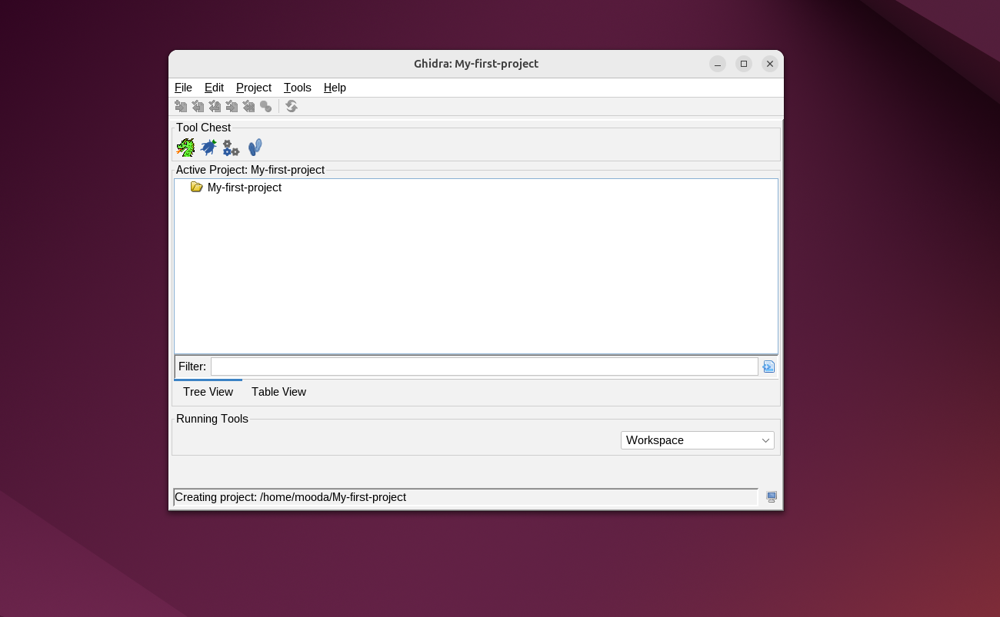
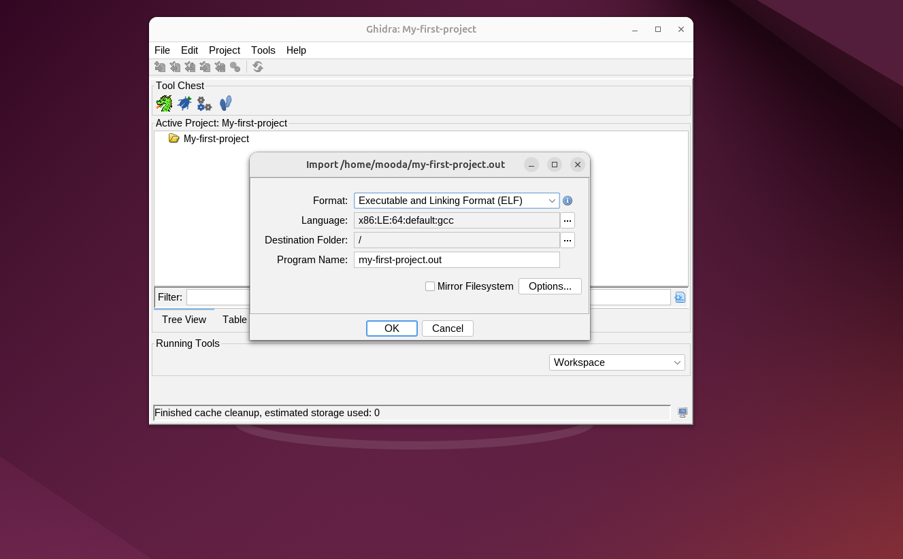
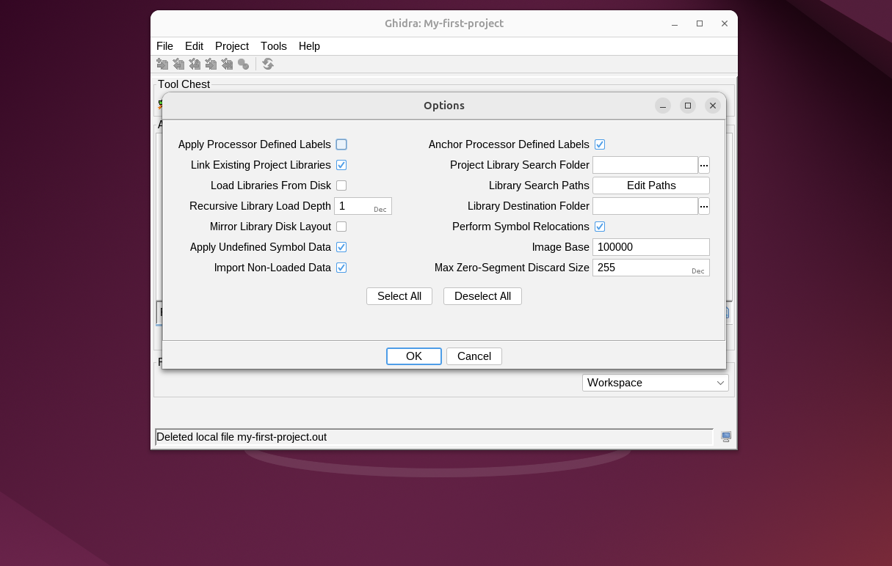
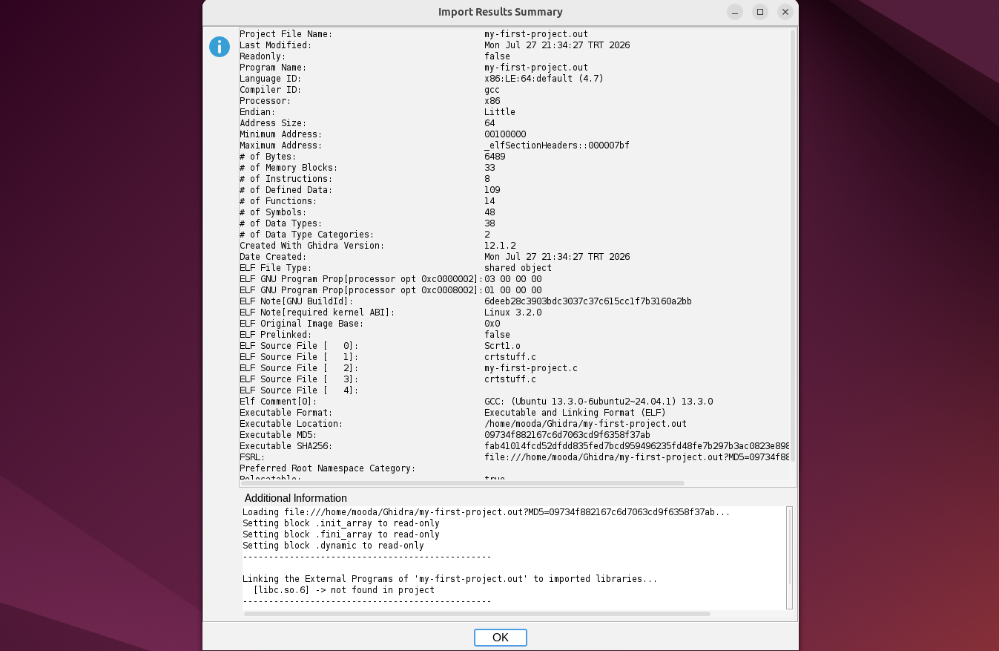
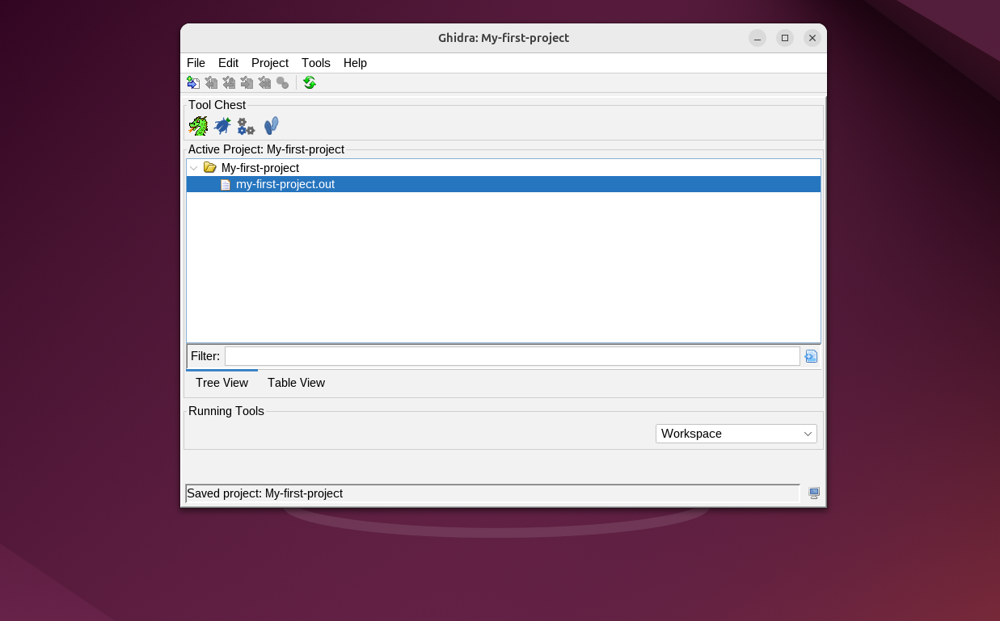

<Intro>
## In This Article
Previously in this series, we learned about **Ghidra** and installed it. In this article, we will create our first Ghidra project, become familiar with the **Ghidra Project Window**, and import our first binary into the project.
</Intro>

<!-- truncate -->

## Launching Ghidra

As soon as you launch Ghidra, a splash screen containing information such as Ghidra's logo and version number, build information, Java version, and licensing information will briefly appear, as shown in the following screenshot:

Once it disappears, you will see two windows on your screen: the **Tip of the Day dialog** window, and the **Ghidra Project** window. Do not bother reading the tips because you are already here on my blog to learn tips and much more 😁. But seriously, if you prefer to read them, simply scroll through them by clicking the **Next Tip** button.

<AlertBox variant="tip" title="Tip:">
I bet you want to uncheck the **Show Tips on Startup?** checkbox at the bottom of the dialog window. But if you ever want it back, you can re-enable it through the **Help** menu.
</AlertBox>

Now that you are ready to begin working, just close the dialog box and focus on your essential window (there is much more to this window than just creating projects, as you will see in later blog posts). I mean the **Ghidra Project** window.

## The Ghidra Project Window

Creating your first project in Ghidra is as easy as going to **File** → **New Project**, as shown in the picture below:

Having done that, you will be asked to choose between a **Non-Shared Project** and a **Shared Project**. As individual reverse engineering practitioners, we need to create a non-shared project since a shared project is intended for teams that want to collaborate through a Ghidra Server. After that, specify the directory where your project will reside, choose a project name, and finally click the **Finish** button.

With the project created, you will be redirected to an empty Project Window.

## Importing Your Files

Now, let us add our first binary to the project by going to **File** → **Import** and selecting the binary file we want to analyze. After choosing our binary, the **Import** window will pop up, as shown below:

<AlertBox variant="tip" title="Tip:">
Navigating and working efficiently is an important skill to have, especially in tedious or repetitive reverse engineering workflows. Ghidra provides plenty of keyboard shortcuts to make our lives easier. We will learn many of them throughout this journey. Our first shortcut is **I**, which opens the file explorer and allows us to navigate to and import our file.
</AlertBox>

This window presents us with lists, fields, and buttons, so let us try to make sense of each one:

### Format

This is a pick list that shows the file formats Ghidra can import. Fortunately for us, Ghidra is smart enough to determine the binary's file type automatically by examining its file header. In our case, it recognizes the file as an ELF executable, which is exactly what we expect since we are working on Ubuntu, where ELF is the standard executable format.

Opening the list reveals another format called **Raw Binary**. Ghidra automatically falls back to this option whenever it cannot recognize the loaded file type. Therefore, if **Raw Binary** is the only option shown, it usually means that Ghidra's loader could not identify the binary.

In such cases, the automatic loading process can no longer help you, so it becomes your responsibility to provide the missing information manually, such as the processor architecture, endianness, and the appropriate language specification.

### Language

The Language field displays the language specification Ghidra selected for the imported binary. This specification describes important characteristics of the program, such as its processor architecture, endianness, address size, and processor variant. Ghidra determines all of this information automatically from the binary whenever possible.

In most cases, Ghidra selects the correct language for you, so there is usually no need to change it. However, if the binary could not be identified correctly__such as when importing a raw binary__you may need to choose the appropriate language manually.

### Destination Folder

This field lets you specify the project folder into which your binary will be imported.

### Program Name

This text field specifies the name Ghidra will use for your imported program inside the project. By default, it uses the same name as the original binary, but you are free to rename it to anything you like without affecting the original file on disk.

### Options

This button provides additional settings that give you more granular control over how Ghidra imports your binary.

If you are just getting started, I recommend sticking with the default settings Ghidra chooses for you. They are suitable for the vast majority of binaries you will encounter. As you become more experienced, you can begin exploring the additional import options shown below to better understand how they influence the loading process.

Once we click **OK**, Ghidra displays an **Import Results** window summarizing the import process. Here, you can review the information you selected, along with the details Ghidra automatically inferred from the binary.

With that done, we now have our first project with our first binary ready to analyze!

## Closing Comments

The **Ghidra Project Window** is much more than just a place for creating projects and importing files. It serves as the central hub from which you will organize your reverse engineering work, manage your imported programs, and access many of Ghidra's features throughout this series.

One important thing to remember is that Ghidra comes with many built-in loaders. Whenever you import a binary, it automatically tries to select the most appropriate loader based on the file's contents. If the file cannot be recognized, Ghidra falls back to the **Raw Binary** loader and asks you to provide the missing information manually.

Unless you are certain that Ghidra made the wrong choice, trust its instincts and stick with the defaults. Most of the time, they are exactly what you need.

I hope this article helped you create your first Ghidra project and gave you a better understanding of what happens behind the scenes when importing a binary. In the next article, we will finally enter the **CodeBrowser** and begin exploring the place where the real reverse engineering starts.
