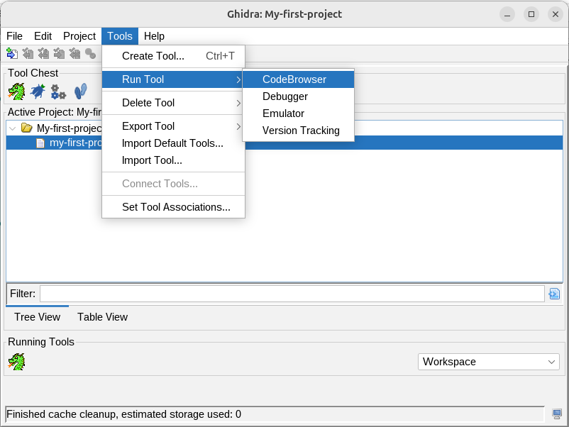
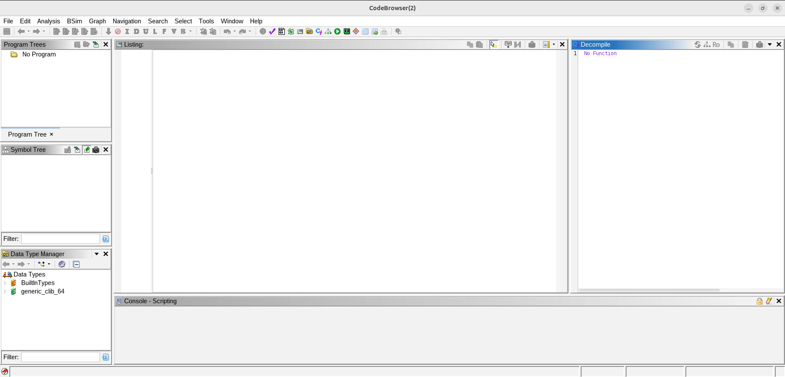
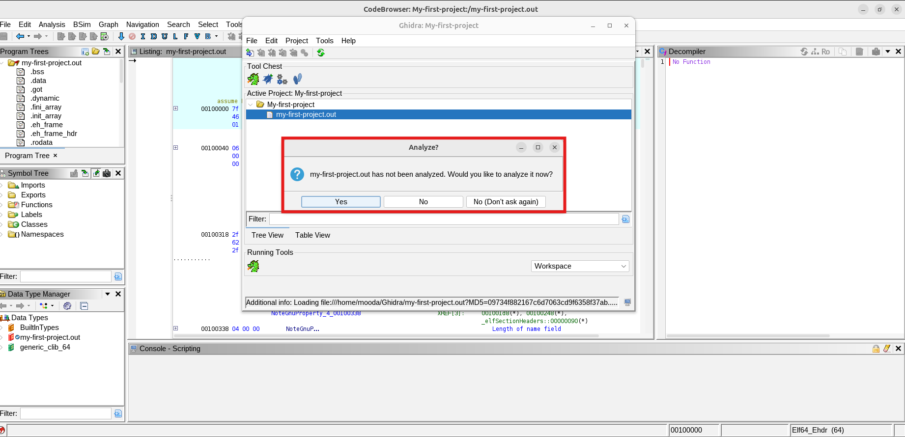
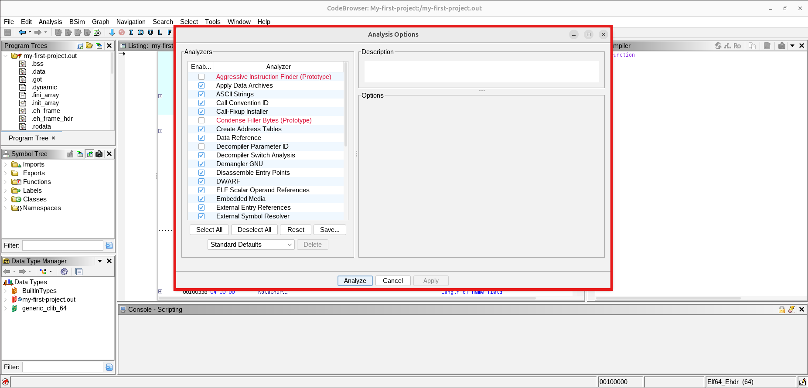
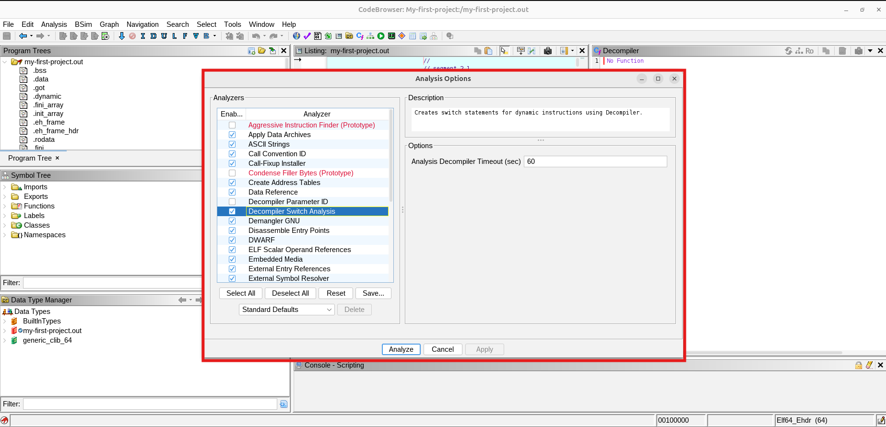
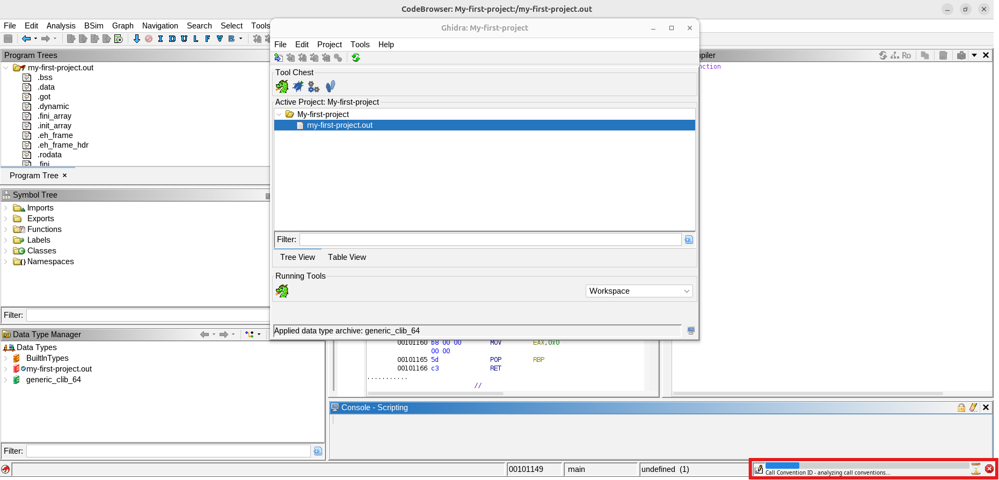

<Intro>
## In This Article

So far, we have seen how we can create projects and load files into them. Later on, we explored the CodeBrowser window. In today's article, we will be covering the **Auto Analysis** step that populates the CodeBrowser window with much of the information we see in it. So let's dig in!
</Intro>

<!-- truncate -->

We have become acquainted with the CodeBrowser window along with its windows. But where does all the information presented in these windows come from? As a matter of fact, the CodeBrowser window is just an empty interface! It later gets populated with information once we select a file for analysis. Do you want to see that in action? Go back to the Ghidra Project window and select **Tools** → **RunTool** → **CodeBrowser**.

After clicking on the CodeBrowser item, you will be presented with an empty CodeBrowser instance like the one shown in the screenshot below:

Now that we have seen the CodeBrowser in its empty state, let's return to our original question: where does all the information we normally see in it come from? This is where Auto Analysis comes into play.

## Running Auto Analysis

The first time we select an imported file, a window pops up asking us if we want to analyze it:

Having selected the Yes option, the **Analysis Options** dialog shows up with a bunch of analyzers to choose from:

Unless you are dealing with an unusual binary that requires special analysis (an example of that would be an obfuscated binary), just stick with the options Ghidra has already checked for you. If you select any of the analyzers listed in the Analysis Options dialog, you will see a bunch of useful information about it in the panel to the left, like its description and other options you can use to tune it:

After clicking the Analyze button, the real work of analysis begins.

One way Ghidra tells you that analysis is underway is with a small progress bar at the bottom-right corner of the status bar:

The progress bar is useful because it tells you what is going on, such as which analyzer Ghidra is currently running. Also, it allows you to stop the analysis process using that little red cross icon.

Depending on the size of the file being analyzed, the amount of time taken by Ghidra to perform the analysis may vary; it may take a few seconds, a few minutes, or even hours when processing extremely large files. If the analysis takes too long to finish, you might want to set a timeout for a certain analyzer or uncheck unwanted analyzers in the Analysis Options dialog.

<AlertBox variant="tip" title="Tip">
Wait! what if I need that analyzer later?

Well, do not worry, pal. If you want to rerun a timed-out analyzer or reenable one, it is as simple as going to **Ghidra's Analysis** menu and selecting the corresponding option.
</AlertBox>

## Auto Analysis Results

